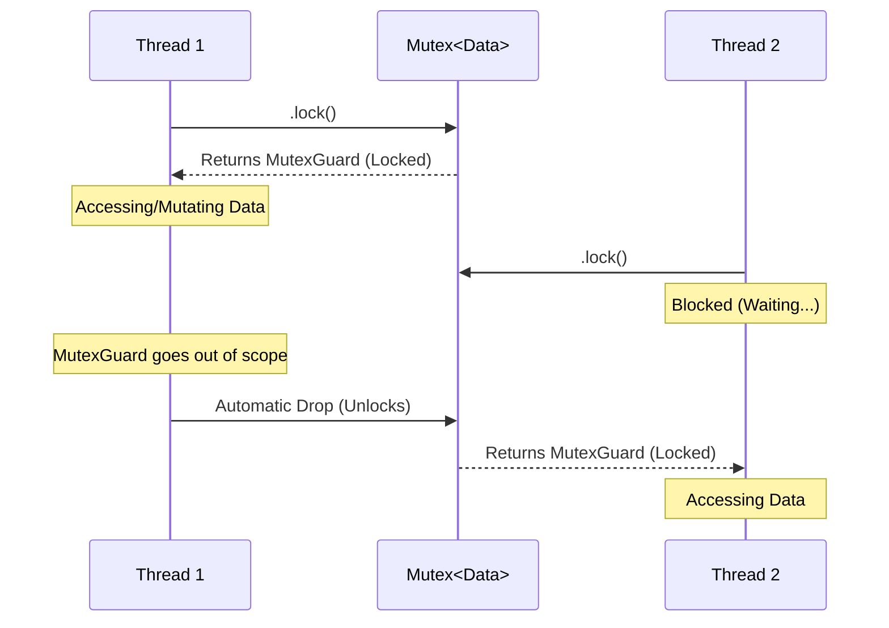
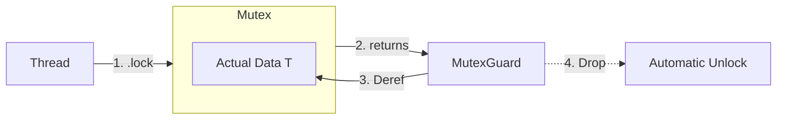

# Mutex (Mutual Exclusion)

A **Mutex** is a synchronization primitive used to grant exclusive access to a shared resource in a ==concurrent environment==. It ensures that only one thread can access the data at any given time, preventing **Race Conditions**.

## 1. General Programming Concept
In most languages, a Mutex is a "flag" or "lock" that sits *beside* the data. You must remember to:
1. Lock the Mutex.
2. Access the data.
3. Unlock the Mutex.

**The Risk:** If you forget to unlock, the system **deadlocks**. If you forget to lock, you get **data corruption**.

## 2. The Rust Implementation: `Mutex<T>`
Rust redefines the Mutex by tying it directly to the **Ownership System**. 

*   **Data Encapsulation:** In Rust, the Mutex *contains* the data. You cannot access the data `T` without first calling `.lock()`.
*   **RAII (Resource Acquisition Is Initialization):** Rust doesn't have an `unlock()` method. Instead, `.lock()` returns a `MutexGuard`. When this guard goes out of scope (is dropped), the Mutex unlocks automatically.
*   **Interior Mutability:** `Mutex<T>` allows you to mutate data even if you only have an immutable reference to the Mutex itself.

## 3. Mental Models

### A. The Talking Stick (The "Lock")
Imagine a group of people in a room. Only the person holding the **Talking Stick** is allowed to speak.
*   If you want to speak, you must wait for the current holder to put the stick back on the table.
*   In Rust, the "Stick" and the "Message" are in the same box. You can't read the message without taking the stick.

### B. The Single-Key Bathroom
*   There is one bathroom (the Data) and one key (the Mutex).
*   To enter, you take the key from the counter.
*   While you are inside, others must wait in line (the Thread Queue).
*   When you leave, you put the key back. In Rust, the "Key" is the `MutexGuard` that disappears when you walk away.

## 4. Visual Diagrams

### Mutex Lifecycle

### The "Box" Architecture

## 5. Meta-cognition Questions

1.  **Safety:** How does the `MutexGuard` prevent the "forgot to unlock" bug that is so common in C++ or Java?
2.  **Architecture:** If a Mutex ensures only one thread has access, why do we almost always see it wrapped in an `Arc<T>`? (Hint: Think about Ownership vs. Sharing).
3.  **Performance:** What happens to the "Event Loop" (Reactor Pattern) if a thread inside the loop tries to acquire a Mutex lock that is held by a long-running background task?
4.  **Deadlocks:** If Thread A locks Mutex 1 and wants Mutex 2, while Thread B locks Mutex 2 and wants Mutex 1, how can we design our system to avoid this "Deadly Embrace"?
5.  **Alternatives:** When would you use a `RwLock` (Read-Write Lock) instead of a `Mutex`, and what are the trade-offs in terms of complexity?
