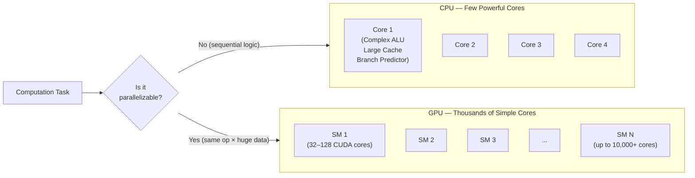
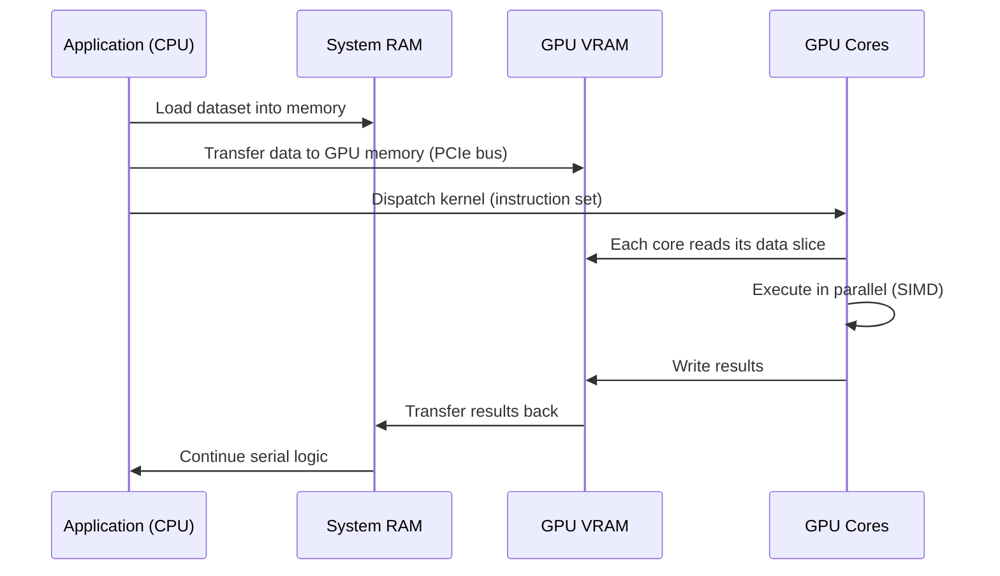
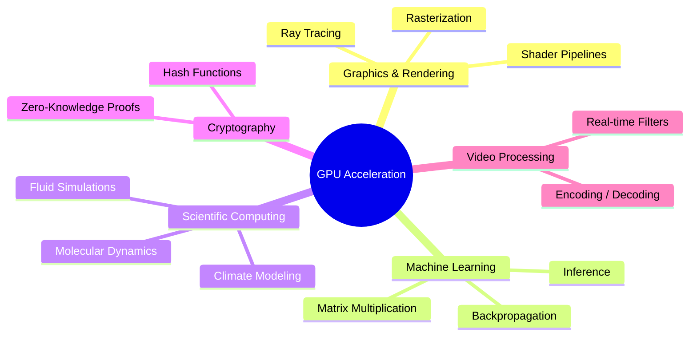
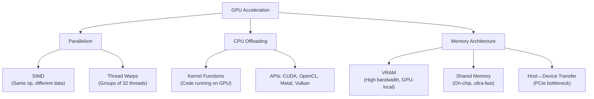
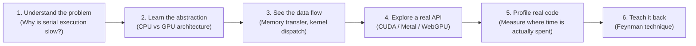

# GPU Acceleration

> **Meta-cognitive checkpoint** — Before reading: What do you already know about how a computer processes tasks? Rate your confidence (1–5) on the difference between CPU and GPU. Revisit this rating after finishing the note.

---

## What is GPU Acceleration?

**GPU Acceleration** is the use of a *Graphics Processing Unit* (GPU) alongside a *Central Processing Unit* (CPU) to speed up computation by offloading tasks that benefit from **massive parallelism** — executing thousands of smaller operations simultaneously instead of sequentially.

The core idea: some problems are not *faster with a smarter processor*, they are faster *with more processors working in parallel*.

---

## Mental Model: The Restaurant Analogy

> **Meta-learning tip** — Analogies anchor abstract concepts. Map each element below to its technical counterpart before moving on.

| Restaurant | Computing |
|---|---|
| Head Chef (expert, one person) | CPU core |
| Kitchen brigade (many cooks, repetitive tasks) | GPU shader cores |
| Complex recipe requiring judgment | Serial computation (CPU task) |
| Chopping 10,000 vegetables identically | Parallel computation (GPU task) |

---

## CPU vs GPU: Architecture Contrast



---

## How GPU Acceleration Works: Data Flow



> **Meta-cognitive prompt** — Can you explain why the *memory transfer* step (PCIe bus) is often the bottleneck? Think about it before reading on. This is called the *memory wall* problem.

---

## SIMD: The Execution Model

GPU cores use **SIMD** — *Single Instruction, Multiple Data*. One instruction is broadcast to hundreds of cores; each core applies it to its own piece of data simultaneously.

```
Instruction: MULTIPLY
                │
    ┌───────────┼───────────┐
    ▼           ▼           ▼
 Core 1      Core 2      Core 3   ...  Core N
 3 × 2       5 × 2       7 × 2         N × 2
  = 6          = 10        = 14
```

Contrast with CPU serial execution:
```
3 × 2 → 6
5 × 2 → 10   (one after another)
7 × 2 → 14
```

---

## Where GPU Acceleration Applies



---

## Key Concepts Hierarchy



---

## When NOT to Use a GPU

> **Meta-cognitive trap** — GPU acceleration is not always faster. This is a common misconception to actively resist.

| Scenario | Why GPU is *worse* |
|---|---|
| Sequential logic (if/else chains) | Thread divergence stalls warps |
| Small datasets | Transfer overhead > compute gain |
| Low-latency single operations | Scheduling overhead is too high |
| Tasks with heavy branching | SIMD breaks down with divergent paths |

**Rule of thumb:** GPU shines when you have the **same operation** over **large, uniform data**.

---

## Meta-Learning: How to Build This Knowledge



### Questions to test deep understanding

- [ ] Can you explain why matrix multiplication is *ideal* for GPU acceleration?
- [ ] What happens when two GPU threads try to write to the same memory location?
- [ ] Why does a GPU have *less* cache per core than a CPU?
- [ ] What is a "warp" and what is "warp divergence"?
- [ ] When would you choose OpenCL over CUDA?

---

## Connections

- [[CPU Architecture]] — understand serial execution first
- [[Memory Hierarchy]] — VRAM, shared memory, registers
- [[CUDA Programming]] — NVIDIA's GPU compute API
- [[Machine Learning Fundamentals]] — primary modern use case
- [[Parallel Computing]] — broader theory of concurrent execution

---

## Meta-cognitive Reflection (Post-reading)

> Answer these after finishing the note — this is spaced practice built in.

1. **What surprised you most** about how a GPU works?
2. **Where was your mental model wrong** before reading this?
3. **What is still fuzzy?** Write it as a question and investigate it next.
4. Re-rate your CPU vs GPU understanding (1–5). What changed?

---

*Tags: #operating-system #hardware #parallelism #gpu #performance #meta-learning*
