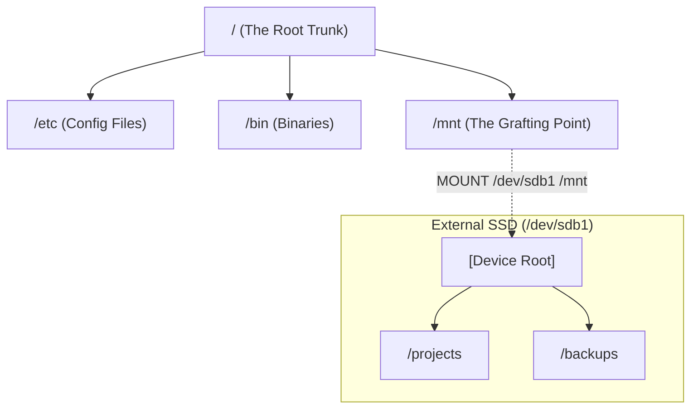

# Linux: The Architecture of Mount and Unmount

As a systems engineer, you must realize that **Linux doesn't see "Drives" (C:, D:), it sees "Namespaces".** 

## 1. The Very Basics: The Unified Tree
In Windows, every drive is a separate tree. In Linux, there is only **The Root (/)**. 

**Diagram: The "Grafting" Metaphor**


When you mount, you are telling the Kernel: *"Hey, whenever someone enters the directory `/mnt`, don't look at the local disk anymore. Instead, jump over to the address space of `/dev/sdb1`."*

---

## 2. Low-Level: How it works in Memory
This is where it gets interesting. The Kernel uses a layer called the **VFS (Virtual File System)**.

### The `vfsmount` Structure
In the Kernel's memory (C-structs), every mount is tracked by a structure called `vfsmount`.

```text
Memory Layout (Conceptual)
---------------------------
[ Kernel Space ]
       |
       +--> [ Mount Table ]
               |
               +-- Mount ID: 42
               |   Source: /dev/sdb1 (Major/Minor numbers)
               |   Target: /mnt
               |   Flags:  read-only, noatime
               |   Reference Count: 3  <-- CRITICAL FOR UNMOUNTING
```

### Metacognition: The "Busy" Error
Why does `umount` fail? Look at that **Reference Count**.
1.  If a process (like `bash`) has its **Current Working Directory (CWD)** set to `/mnt/projects`, the Ref Count is `1`.
2.  If a text editor has `/mnt/notes.txt` open, the Ref Count becomes `2`.
3.  **Kernel Rule:** You cannot unmount a device if `Reference Count > 0`.

---

## 3. The "Chicken and Egg" Problem: Mounting the Root (/)
If you need the `mount` command to graft a branch, how do you get the trunk?

**The Boot Sequence:**
1.  **BIOS/UEFI:** Loads the **Bootloader** (GRUB).
2.  **Kernel:** The Kernel is loaded into memory, but it has no filesystem yet!
3.  **initramfs:** The Kernel loads a "Mini-Filesystem" into RAM (a temporary root).
4.  **The Pivot:** The Kernel finds the real hard drive, mounts it as the *New Root*, and then "swaps" the temporary RAM-disk for the real disk. This is called a `pivot_root`.

---

## 4. Key Commands & Their System Impact

| Command | System Impact |
| :--- | :--- |
| `mount` | Creates a new entry in the Kernel's Mount Table and updates VFS. |
| `umount` | Checks Reference Count. If 0, removes entry and flushes buffers. |
| `lsblk` | Queries the `/sys` filesystem to list physical block devices. |
| `findmnt` | The best "Senior" tool to see the current tree structure. |

---

## 5. Senior Tip: The `lazy` Unmount
Sometimes a device is stuck but you NEED to pull it. 
`umount -l /mnt` (Lazy Unmount)
-   **What it does:** It immediately "detaches" the filesystem from the tree so no *new* processes can access it.
-   **In Memory:** It waits for the existing processes to finish (Ref Count to hit 0) before actually cleaning up the memory structures. It's a "soft" exit.
