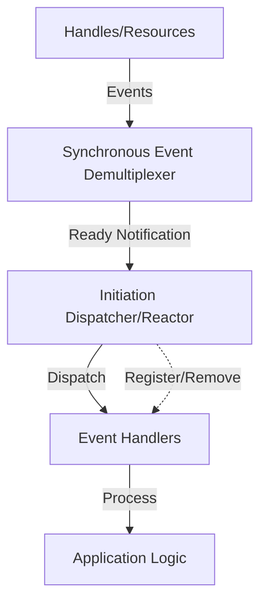
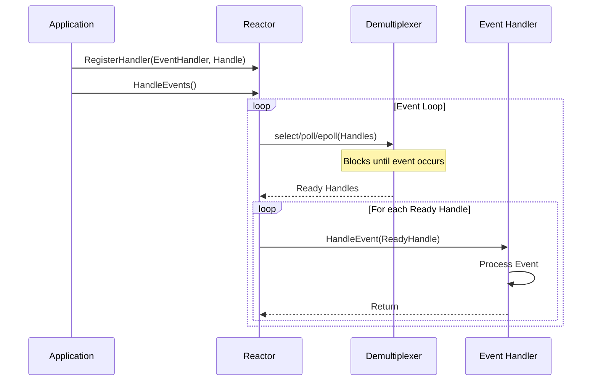
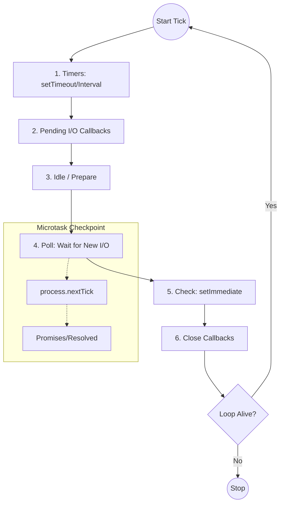

# Event Loop and the Reactor Pattern

The Event Loop is the structural backbone of high-performance, non-blocking I/O systems. While often used interchangeably with the "Reactor Pattern," the Reactor is the formal design pattern that describes how events are demultiplexed and dispatched.

## 1. The Reactor Design Pattern
Formalized by **Douglas C. Schmidt**, the Reactor pattern is an object-oriented behavioral pattern that enables an application to handle multiple service requests delivered concurrently by one or more clients.

### Key Components

- **Handles (Resources):** Identified by the OS (e.g., file descriptors, sockets). They represent the source of events.
- **Synchronous Event Demultiplexer:** An OS-level system call (e.g., `epoll`, `kqueue`, `select`) that blocks until events occur.
- **Initiation Dispatcher (The Reactor):** The central hub that runs the loop and dispatches events.
- **Event Handlers:** Logic that defines how to process specific event types.

### The Workflow

## 2. The Event Loop Architecture
In modern runtimes like Node.js or Python's `asyncio`, the Event Loop implements the Reactor pattern to achieve high concurrency without the overhead of multi-threading.

### Core Philosophy: "Never Block the Loop"
Because the loop typically runs on a single thread, any synchronous, long-running operation will "starve" the loop, preventing it from processing other pending events.

## 3. Implementation Deep Dive: libuv & Node.js
Node.js uses **libuv** as its underlying engine to manage the Reactor loop.

### libuv Loop Stages (The "Tick")

### Microtask Queues (Node.js Specific)
Between every stage of the libuv loop, Node.js checks two high-priority queues:
- **`process.nextTick()` Queue:** Drained immediately after the current operation.
- **Promise Queue:** Drained after `nextTick` but before the next loop phase.

## 4. Recommended Reading

### Seminal Papers
- **"The Reactor: An Object Behavioral Pattern for Demultiplexing and Dispatching Handles for Synchronous Events"** by Douglas C. Schmidt.
- **"The Proactor Design Pattern"** by Douglas C. Schmidt.
- **"The C10K Problem"** by Dan Kegel.

### Technical Articles & Documentation
- **[Node.js Event Loop, Timers, and process.nextTick()](https://nodejs.org/en/docs/guides/event-loop-timers-and-nexttick/)**
- **[libuv Design Overview](http://docs.libuv.org/en/v1.x/design.html)**
- **"Everything You Need to Know About the Node.js Event Loop"** by Bert Belder.
