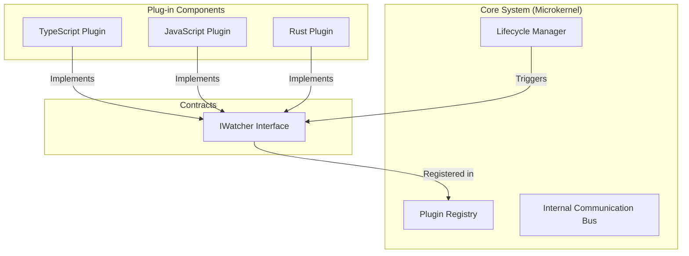
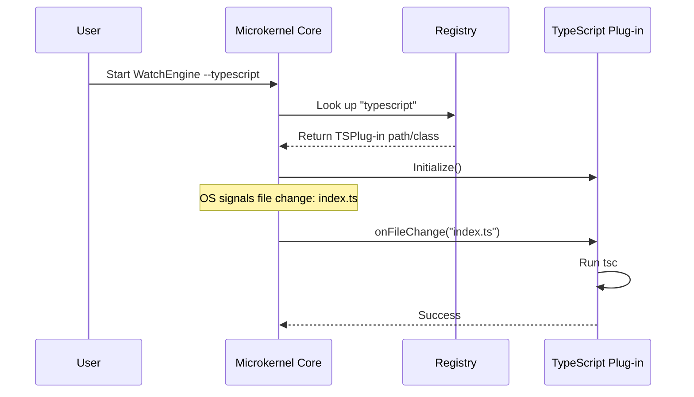

# Microkernel Architecture (Plug-in Architecture)

The **Microkernel Architecture** is a pattern designed to create extensible and adaptive applications. It achieves this by separating a minimal "Core System" from its extended functional features, which are implemented as independent "Plug-in Components."

## 1. Core Structural Components

### A. The Core System
The "heart" of the application. It contains only the **minimal** functionality required to make the system operational.
- **Responsibilities:** Resource management, plug-in discovery, and orchestration.
- **Stability:** The core should be highly stable and rarely change.
- **Example:** In an IDE, the core handles file opening and the windowing system, but not the actual language parsing.

### B. Plug-in Components
Independent modules that contain specialized processing logic or additional features.
- **Isolation:** Plug-ins should not know about other plug-ins.
- **Dynamic Loading:** They can be added, removed, or updated without modifying the core.
- **Example:** A `TypeScriptWatcher` plug-in that knows how to run `tsc` when a `.ts` file changes.

### C. Registry
A internal directory (often a Map or a configuration file) that keeps track of:
- Which plug-ins are available.
- Their metadata (name, version, supported file extensions).
- Where to find their execution entry point.

### D. Contracts (Interfaces)
The "Rules of Engagement." The core defines a strict interface (e.g., `onFileChange(path: string)`) that all plug-ins must implement. This ensures the core can interact with any plug-in without knowing its internal implementation.

## 2. Interaction Workflow

## 3. Benefits & Trade-offs

### Benefits
- **Extensibility:** New features can be added by simply creating a new plug-in.
- **Isolation:** A bug in the JavaScript plug-in won't crash the core engine.
- **Separation of Concerns:** Developers can focus on language-specific logic without worrying about OS-level file-watching code.
- **Configurability:** Users only load the modules they need (e.g., `--typescript`), keeping the runtime lightweight.

### Trade-offs
- **Complexity:** Designing the initial "Contract" and "Registry" requires significant up-front effort.
- **Performance Overhead:** Depending on the implementation, there may be slight overhead in dispatching events from the core to plug-ins.
- **Versioning:** Changing the Core's contract can break all existing plug-ins.

## 4. Real-World Examples
- **IDEs:** VS Code, Eclipse, IntelliJ.
- **Browsers:** Chrome/Firefox (Extensions).
- **Operating Systems:** Minix, QNX (The inspiration for the pattern name).
- **Build Tools:** Webpack (Loaders/Plugins), Babel.
